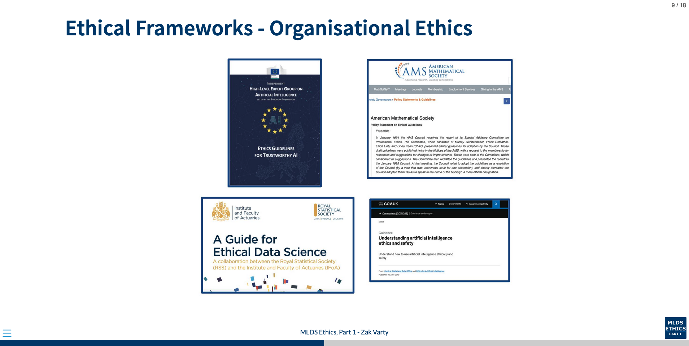

## Live Session Outline 

- Introductions and expectations for live sessions / office hours. (10 mins)
- Activity: Group discussion of ethical guidelines provided by various organistions. (20 mins)
- Feedback from groups. (20 mins) 
- Flex time for overrun (5 mins).
- Optional extension: discussion on how presentation impacts the palatability of (5 mins)

## To save as pdf 

1. Recompile HTML using `quarto render` or similar.
2. Open html file in google chrome, and press `E` to enter print view
3. `CTRL/CMD + P` to open print dialog 
4. Change __destination__ to __Save as PDF__
5. Change the __Layout__ to __Landscape__
6. Change the __Margins__ to __None__ 
7. Enable __Background Graphics__
8. Click __Save__.