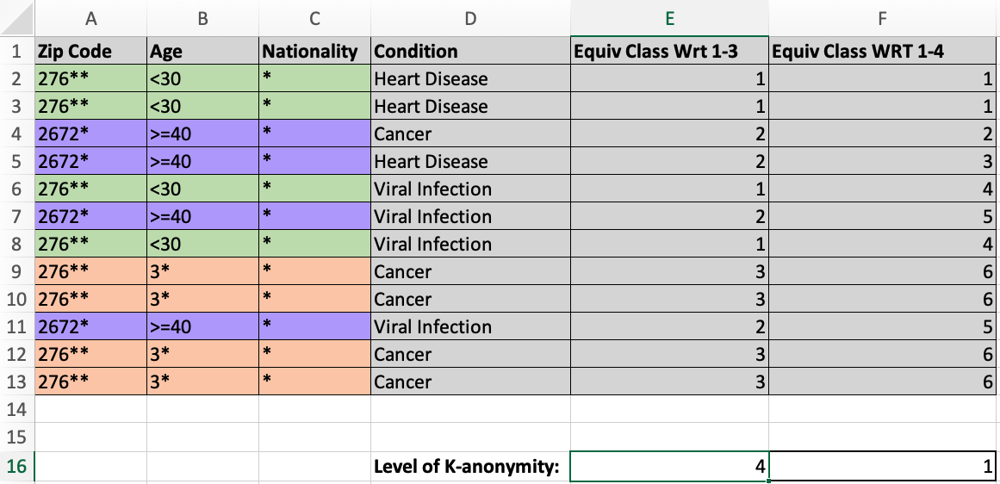

# Ethics Part 1, Live Session 2: Privacy

## Session Outline 

- Session focus: K-anonymity and randomised response survey designs. 

- K-anonymity worked example hospital data base. (15 mins)

- Group exercise (20 mins)
	- I asked ChatGPT to generate 4-anonymous dataset but it hasn't done a good job. 
	- Establish the true vaule of $k$ for your dataset. 
	- Using the techniques covered this week, make the dataset 4-anonymous. 

- Feedback to the group (20 mins) 
	- How did ChatGPT do?
	- How did you anonymise your dataset? 
	- What did you have to consider as you were doing this?

- BONUS: [Recorded walkthrough](https://youtu.be/Dms_toP_4s0) for checkpoint 1 question 2 on study drug use. (~20 mins)

