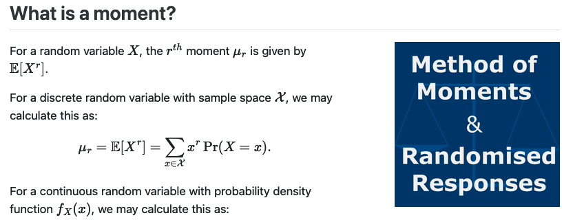

# Ethics Part 1, Live Session 3: Fairness



## Session Outline 

We are now half way through the course, so will provide a chance for any questions on the material so far.

Once any questions are addressed we can walk through solutions to the fairness excercise sheet as required. 

A overview of Method of Moments estimation might be helpful, separate from randomised response. A written summary is in the assets folder and on my website as a blog post.  

## To render the MoM sheet

```
# Render HTML document
quarto render method-of-moments-for-randomised-response-surveys.qmd --to html --self-contained

# Render PDF document
quarto render method-of-moments-for-randomised-response-surveys.qmd --to pdf
```