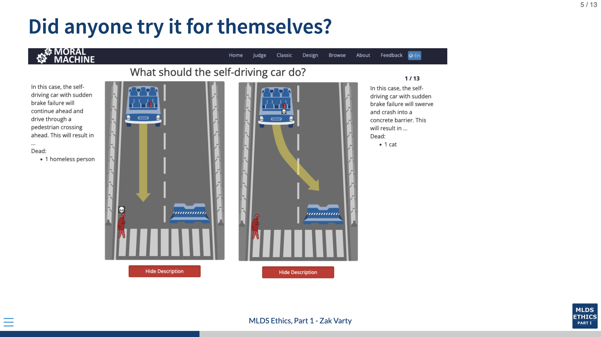

# Ethics Part 1, Live Session 4: Value Alignment

## Session Outline 

- Group Discussion: Moral machine experiment. (10 mins)
	- What was interesting / surprising to you
	- Did anyone try [the experiment](https://www.moralmachine.net/) for themselves?
- Breakout room discussions (20 mins):
	1. Summary and critique of visualisations within the paper
	2. Bigman critique - discuss contextual importance of trolley problems and construct own example.
- Feedback from groups. (20 mins) 
- Flex time for overrun (5 mins).

## To save as pdf 

1. Recompile HTML using `quarto render` or similar.
2. Open html file in google chrome, and press `E` to enter print view
3. `CTRL/CMD + P` to open print dialog 
4. Change __destination__ to __Save as PDF__
5. Change the __Layout__ to __Landscape__
6. Change the __Margins__ to __None__ 
7. Enable __Background Graphics__
8. Click __Save__.